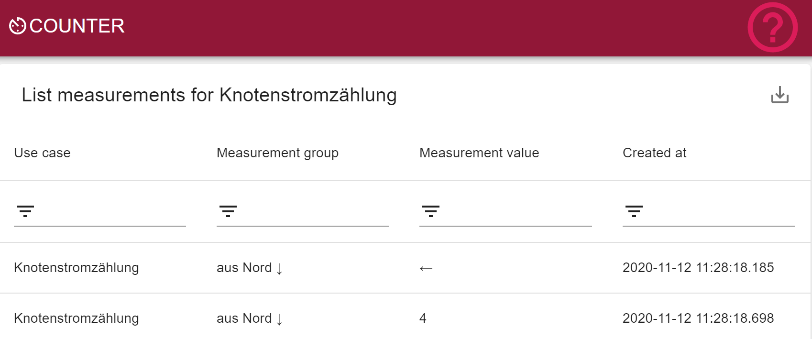

# Counting app - Demo React and NodeJS app

## Scope
The goal was to create a dynamic counter app to replace the current paper-heavy counting tasks. The application must be able to run on the mobile and must be intuitive.

## Design
### Frontend
Using react in combination with the material design to create a intuitive UI.

### Backend
Backend API is using node and postgres as persistent datastore.

# Development
Backend and frontend are combined in this project.
For the runtime the following env variable can control behavior of the application:

## Environment Variables
### Frontend
    # React Dev Port
    PORT=3100

    # Key for Google Captcha v3
    REACT_APP_CAPTCHA_SITE_KEY=key

    REACT_APP_BACKEND_URL=http://localhost:8080

    # Further details regarding the build app
    REACT_APP_VERSION=1.0.0
    REACT_APP_NAME=$npm_package_name

### Backend
    NODE_ENV=development

    # Database Information
    DB_HOST=localhost
    DB_NAME=counter-database
    DB_USER=postgres
    DB_PASSWORD=password

    # Test Secret
    PASSPHRASE=secret

## Available Scripts
### Migrations
The backend provides the following commands to initiate the database and run the migrations.

    # create database
    npx sequelize-cli db:create

    # run migrations
    npx sequelize-cli db:migrate

### Run the development environment `npm run dev`
Runs the app in the production mode. 
Open [http://localhost:8080](http://localhost:8080) to view the backend in the browser.
Open [http://localhost:3100](http://localhost:3100) to view the frontend in the browser.

The page will reload if you make edits. You will also see any lint errors in the console.

### Run the production environment `npm start`
Runs the app in the production mode. 
Open [http://localhost:8080](http://localhost:8080) to view the backend in the browser.
Open [http://localhost:3100](http://localhost:3100) to view the frontend in the browser.

### `npm run build` - only available for frontend
Builds the app for production to the `build` folder. 
It correctly bundles React in production mode and optimizes the build for the best performance.

The build is minified and the filenames include the hashes. Your app is ready to be deployed!